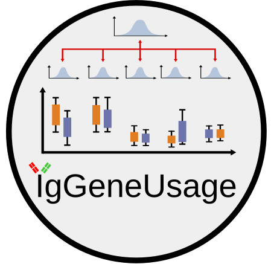

# IgGeneUsage <a href="https://github.com/snaketron/IgGeneUsage/">

   

# Overview
IgGeneUsage: computational tool for the analysis of differential gene usage (DGU) in B- and T-cell receptor repertoires.

For more information see vignettes in folder vignette/. 

